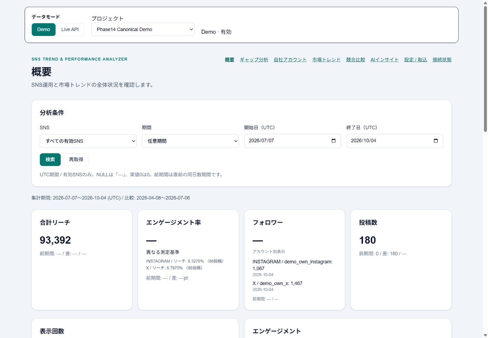
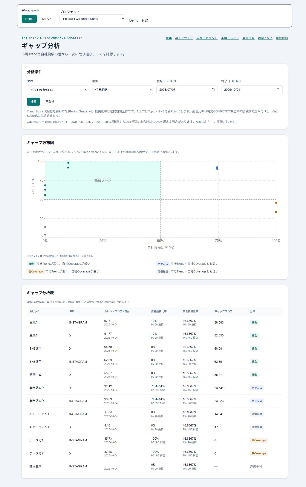
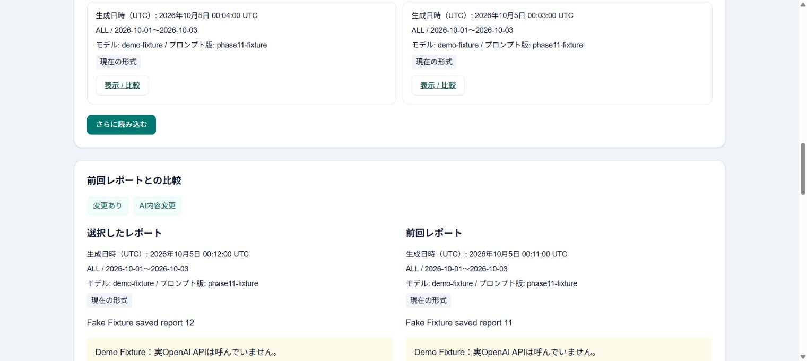

# SNS Trend & Performance Analyzer — Version 2.0 Interim

[日本語 README](README.md)

A decision dashboard connecting social performance, market trends, competitor analysis and content gaps to evidence-backed AI suggestions and snapshot comparison. CSV and X Live share a normalizer and seven analysis/settings screens.

**X: Complete / previously real-verified. Instagram: Deferred / OAuth and Profile foundation only.**
Docker reproduces a fictional Demo without X, Instagram or OpenAI credentials. Version 2.0 Interim is a Release Candidate ready for user review. Publication is pending.



## Features

| Feature | Status |
| --- | --- |
| CSV Import / Canonical Demo | Complete; fictional X / Instagram data |
| Overview | Complete |
| My Account | Complete; NULL remains distinct from zero |
| Trend Explorer | Complete; UTC seven-day rolling score |
| Competitor Analysis | Complete |
| Gap Analysis | Complete; four classifications |
| AI Generate / saved Evidence | Complete; Demo uses a fixed Fake fixture |
| AI History / Compare Previous | Complete; append-only snapshots, no API call on read |
| Demo / Live mode | Complete; immutable Project mode, no Demo fallback |
| X OAuth / Refresh / manual sync | Complete; previously real-verified in private environment |
| X Scheduled Sync | Complete; previously real-verified, PostgreSQL schedule + fixed Beat tick |
| Instagram Live | Deferred; OAuth / Profile foundation only |
| JA / EN and responsive UI | Complete; stored content is not translated |

## Screenshots




[12 screenshots and data boundaries](docs/portfolio/screenshots.md)

## Quick Start

Run in the root of a fresh clone or extracted RC. Requires Linux containers in Docker Desktop / Docker Engine, Compose 2.24.4+, PowerShell, network access for initial dependencies and free ports 13014 / 18014 / 15414. A unique Compose project creates new volumes. Do not overwrite an existing .env.demo.

```powershell
Copy-Item .env.example .env.demo
# Change only POSTGRES_PASSWORD in .env.demo to a unique local development password.
$demoProject = "sns-demo-" + [guid]::NewGuid().ToString("N")
$demoArgs = @("--env-file", ".env.demo", "-p", $demoProject, "-f", "docker-compose.yml", "-f", "docs/portfolio/docker-compose.demo.yml")
docker compose @demoArgs build backend frontend worker beat
docker compose @demoArgs up -d --wait
docker compose @demoArgs exec -T backend alembic upgrade head
docker compose @demoArgs exec -T backend python -m app.demo.loader --anchor-date 2026-10-04 --seed 1401 --directory /demo_data/canonical
Invoke-RestMethod http://localhost:18014/api/v1/health
```

[Open Overview](http://localhost:13014/dashboard/overview?platform=ALL&from=2026-07-07&to=2026-10-04). Select Phase14 Canonical Demo. AI Insights displays a saved report. External API credentials and the runtime master key remain empty. Public Demo disables Live operations. Repeating the loader is normally refused.

Stop with docker compose @demoArgs down in the same PowerShell session. Never run down -v or downgrade base against an existing normal/private environment.
For macOS/Linux, use `cp .env.example .env.demo` and substitute a unique `-p` project name and the same two `-f` arguments in each Compose command. [Demo loader and limited reset](demo_data/README.md).

## Canonical Demo

Fictional only: UTC 2026-07-07–2026-10-04, anchor 2026-10-04, seed 1401. OWN 180 / COMPETITOR 540 / MARKET 4,500 posts; Account Daily 180; three competitors, six Topics, twelve Terms. Gap has twelve rows, eleven known-coordinate points and one unknown. AI uses a saved fixed Fake fixture. [CSV manifest](demo_data/manifest.json) · [CSV contract](docs/portfolio/csv_spec.md).

## Architecture and design

| Area | Technology |
| --- | --- |
| UI | Next.js / React / TypeScript / Tailwind CSS / Recharts |
| API | Python / FastAPI / SQLAlchemy / Pydantic |
| Storage | PostgreSQL / Alembic |
| Jobs | Celery / Redis / fixed Celery Beat tick |
| Provider security | OAuth / PKCE / encrypted runtime SecretStore |
| AI | OpenAI Responses API / Structured Outputs |
| Delivery / test | Docker Compose / pytest / Node built-in test |

Browser → Next.js → FastAPI Services / Repositories → PostgreSQL. Fetch → Normalize → business transaction → checkpoint. Generic Provider registry and capabilities keep unsupported operations unavailable. Job delivery uses at-least-once semantics with idempotency. PostgreSQL is the schedule source of truth; fixed Beat ticks dispatch work to Celery / Redis.

OAuth pending state and provider tokens use encrypted runtime storage with TTL/replay checks and log redaction. They are not stored in business DB rows, frontend or job payloads. AI reads aggregate evidence in one read-only snapshot, closes the DB connection before the external call, validates Structured Outputs, then appends a new snapshot. History/Compare reads make no external call.

[Architecture / 18 tables + Alembic](docs/portfolio/architecture.md) · [AI boundaries](docs/portfolio/ai_insights.md) · [Analytics / NULL](docs/portfolio/analytics.md)

## Language

Settings → 表示言語 / Display Language → 日本語 / English. Fixed UI selection is saved in localStorage. Project names, posts, Topics/Terms and saved AI content are not translated.

## Quality and performance

Backend **1631 passed / 0 failed / 0 skipped**, **351.52 s** (controlled run ≤600 s). Frontend **84 passed / 0 failed / 0 skipped / 0 cancelled**, 13,753.04691 ms. Typecheck / production build PASS; 19 static routes. OpenAPI **47 paths**; Alembic **0005_v2_provider_core**, five migrations unchanged. Real X / Instagram / OpenAI **0 / 0 / 0**.

Phase12 controlled local warm benchmarks: Overview ~142 ms; Gap ~43 ms; Trend Ranking ~33 ms; Competitor ~131 ms; Trend rebuild ~1.57 s. These are measured local examples, not production SLA or guaranteed response times. Phase13 full backend runs took 375.85 / 323.42 s; a five-minute guarantee is not claimed.

## Limitations

Instagram posts, metrics, media, insights, pagination and initial/incremental sync remain Deferred. Multi-user authentication, cloud production deployment, SLA and 24/7 operational proof are outside this release. Phase14 makes no real X, Instagram or OpenAI calls; X was previously real-verified. Demo AI is a fixed Fake fixture, not a real model quality evaluation. Stored posts and AI content are not translated. OWN import retains a per-post SELECT for preserved matching. Local benchmark timings are not a production SLA. Full screen-reader audio testing is unperformed.

## Release / portfolio

[English Summary](docs/portfolio/project_summary_en.md) · [Release notes](docs/portfolio/release_notes_v2_interim.md) · [Release checklist](docs/portfolio/public_release_checklist.md) · [Current status](docs/portfolio/version2_interim_status.md)

Private opt-in setup: [X](docs/portfolio/x_api_private_setup.md) / [Instagram foundation and Deferred scope](docs/portfolio/instagram_api_private_setup.md). Public Quick Start requires neither.

## Development history

[V1 historical release](docs/portfolio/release_notes_v1.md) · [Phase13 validation](docs/implementation_reports/v2_phase13_cross_cutting_quality_release_validation.md) · [Phase14 delivery](docs/implementation_reports/v2_phase14_portfolio_finish_interim_release_candidate.md). Historical reports retain their original scope and counts.
