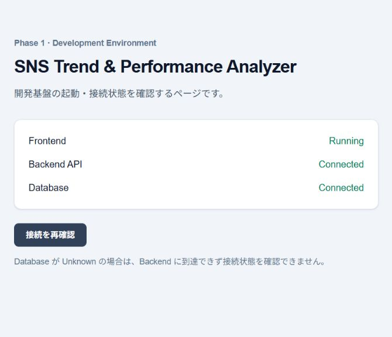

# Phase 2 実装報告書

検証日: 2026-10-03 / ローカルWindows・Docker Desktop・PostgreSQL 17。

## 1. 実装概要

Phase 2のDB基盤のみ実装。SQLAlchemy 2.xの13モデル、Alembic初期Migration、明示実行Seed、PostgreSQL制約テストを追加した。既存Health APIの仕様とFrontend画面は維持した。Phase 3以降は未実装。

正本はユーザーの回答に従い **DB詳細設計書Ver1.1**。Phase 2指示書との差異は次のとおり。

| 項目 | 採用したVer1.1の定義 |
| --- | --- |
| post_terms | match_method / EXACT・NORMALIZED・MANUAL・AI |
| trend_daily | window_days SMALLINT NOT NULL DEFAULT 7 / CHECK =7、両Partial UniqueとTopic・Term検索Indexにwindow_daysを含む |
| account_metrics.raw_metrics | JSONB NOT NULL DEFAULT '{}' |
| ai_insights | CHECK analysis_from <= analysis_to |

avg_engagementはVer1.1のカラム表にCHECK指定があるため、NULLまたは0以上とした。比率は共通説明より各テーブルの具体的定義を優先してNUMERIC(12,4)。Ver1.1末尾のIndex一覧はTermのwindow_daysを省略しているが、trend_daily節の具体的定義を採用した。

## 2. 作業開始時Git状態

既存履歴なし、master、Remoteなし。開始時 `git status --short`:

```text
?? .env.example
?? .gitignore
?? README.md
?? backend/
?? docker-compose.yml
?? docs/
?? frontend/
```

`.env`・依存フォルダー・生成物はignore済み。ユーザー指定のAuthor 利用者指定のAuthor（個人情報は公開用文書から除去） をリポジトリlocal設定へ登録した。

## 3. Phase 1基準点Commit / Push結果

- Commit成功: `2838b4c07f1aa2c2b48fe444e73c7afbfa7303dc`
- Message: `chore: establish Phase 1 baseline`
- 32ファイルを保存。Stage差分と秘密値混入を確認済み。
- Push未実施: Remote未設定。Remote追加・Branch切替・履歴書換えは行っていない。

## 4. 新規作成ファイル

- backend/app/db/base.py
- backend/app/db/models/: __init__.py、project.py、account.py、post.py、topic.py、trend.py、import_history.py、ai_insight.py
- backend/app/db/seed.py
- backend/alembic.ini
- backend/alembic/env.py、script.py.mako、versions/0001_initial_create_initial_schema.py
- backend/tests/__init__.py、postgres_support.py、test_database.py、test_migration.py、test_seed.py
- docs/implementation_reports/Phase2_Implementation_Report.md、Phase2_Health_Check.png

## 5. 変更ファイル

`.gitignore`（coverage・dump除外）、README.md（初期化・テスト手順）、backend/Dockerfile（Alembic同梱）、backend/requirements.txt（Alembicと依存追加）、backend/tests/conftest.py（テスト用DB・ロールバックfixture）。Frontend・docker-compose.yml・既存Health実装は変更なし。

## 6. 13テーブル実装結果

| テーブル | 主な役割 | 開発DBのSeed後件数 |
| --- | --- | ---: |
| projects | 分析プロジェクト | 1 |
| project_platforms | 対象SNS | 2 |
| sns_accounts | OWN・COMPETITOR | 5 |
| account_metrics | 日次指標 | 0 |
| sns_posts | OWN・COMPETITOR・MARKET投稿 | 0 |
| post_metrics | 投稿指標 | 0 |
| watch_topics | 監視テーマ | 2 |
| watch_terms | Keyword・Hashtag | 6 |
| post_topics | 投稿・Topic関連 | 0 |
| post_terms | 投稿・Term関連 | 0 |
| trend_daily | Topic・Termの7日スナップショット | 0 |
| import_histories | CSV取込履歴 | 0 |
| ai_insights | AI分析結果 | 0 |

13業務テーブルと管理用alembic_versionの計14テーブルを実DBで確認。UUID・JSONB・TIMESTAMPTZ・NUMERICを使用。UUIDはPython側で発行し、DBにUUID生成拡張の依存はない。updated_atはSQLAlchemy経由で更新し、Triggerは追加していない。

## 7. PK / FK

全テーブルにPKを設定。post_topics(post_id, topic_id)とpost_terms(post_id, term_id)は複合PK。FKは設計の16参照を設定し、15参照がCASCADE、sns_accounts→sns_postsだけSET NULL。

実DBでProject・Account・Post・Topic・Term削除時の全テーブル件数を確認し、Account削除後のPost存続とaccount_id=NULLを確認。存在しない親IDは全FKで拒否されることも確認した。

## 8. UNIQUE / CHECK

Project/Platform、Account自然キー、Metrics日付・時刻、投稿自然キー、Topic名、Term正規化キーを重複拒否。両関連テーブルの複合PK重複も拒否。

VARCHAR + CHECKで各列挙値を保証。MetricsはNULLと0を区別し負値拒否。関連スコアとTrendの5スコアはNULL・0・100を許可し範囲外拒否。Growth・Acceleration率の負値を許可。Trend window_days=7、件数・平均の非負、Import件数の非負、AI期間の順序を保証。Importの件数合計やテーブル間業務整合性CHECKは独自追加していない。

## 9. Index / Partial Unique Index

設計の日時DESC・逆引きIndexを作成。OWN制約のIndex名は `uq_sns_accounts_one_own_per_platform`。同一Project/PlatformのActive OWNは1件、Inactive OWNと複数COMPETITORは許可。他Platform・他Projectは独立。

Trendは `uq_trend_daily_topic_window`（term_id IS NULL）と `uq_trend_daily_term_window`（IS NOT NULL）によりTopic・Term集計を別々に一意化。通常IndexはTopic/Platform/window/date DESC、Term/Platform/window/date DESC（Term非NULL）、Platform/date DESC/score DESC。PostのAccount検索Indexも非NULL条件付き。

## 10. Alembic構成

target_metadata=Base.metadata。全13モデルをimportし、既存get_settings()から接続設定を取得する。秘密値・DB URLを設定ファイルへ埋め込まない。DockerイメージへAlembic設定とMigrationを同梱。通常経路でcreate_all()を使用せず、API起動時の自動Migrationも追加していない。

## 11. Migration Revision

Revision: `0001_initial` / down_revision: None / head: 1系統。

## 12. upgrade head結果

```powershell
docker compose exec -T backend alembic upgrade head
docker compose exec -T backend alembic current
docker compose exec -T backend alembic heads
```

すべてExit 0、currentとheadsは `0001_initial (head)`。適用前は業務テーブル0件（autogenerateによる空alembic_versionのみ）。通常開発DBにはupgradeのみ実行した。MigrationとModelの差分はcompare_metadata(compare_type=True, compare_server_default=True)で0件。CHECK・PK・FKもカタログ照合済み。

## 13. downgrade / re-upgrade結果（テスト用DBのみ）

test_empty_upgrade_downgrade_reupgradeで空DB→upgrade head→13業務テーブル確認→downgrade base→業務テーブル0確認→再upgrade→13テーブル確認が成功。

テストDB名は `sns_phase2_test_<32桁hex UUID>`。削除・downgradeは厳密な形式検査と通常開発DB名との不一致検査を行う。通常開発DB・Volumeを削除していない。検証後の残存テストDB数は0。

## 14. Seed内容

```powershell
docker compose exec -T backend python -m app.db.seed
```

Demo SNS Analysis Project 1件、X/INSTAGRAM、dummy_demo_own_x/instagram各1件、dummy_demo_competitor_1～3（X2・INSTAGRAM1）、生成AI・業務効率化、ChatGPT・Claude・Gemini・AIエージェント・#生成AI・#ChatGPT。

normalized_termはSeed内の固定値。一般Normalizerは未実装。投稿・Metrics・Trend・AI結果のデモデータは作成しない。

## 15. Seed冪等性確認

開発DBで2回実行、両方Exit 0。最終件数は第6節のとおり。テストでは2回目の全行スナップショットが初回と完全一致し、利用者の名称変更・無効化・独自Project・差し替えActive OWNも保持した。名前を変更したPKと自然キー双方の衝突をDO NOTHINGで扱い、既存行を更新・削除しない。SeedのOWNを無効化済みの場合は自動再有効化しない。

## 16. PostgreSQL実DBテスト結果

```powershell
docker compose exec -T backend python -m pytest -q -p no:cacheprovider
```

| 範囲 | Total | Passed | Failed | Skipped |
| --- | ---: | ---: | ---: | ---: |
| 新規Phase 2 | 119 | 119 | 0 | 0 |
| 既存Phase 1 | 6 | 6 | 0 | 0 |
| 合計 | 125 | 125 | 0 | 0 |

Docker実行: 6.94秒、Warnings 1。新規119件のうち113件は実PostgreSQLを使用、6件は破棄操作の名前ガード。Migration・UUID・JSONB・各CHECK・UNIQUE・Partial Unique・CASCADE・SET NULL・Seedを検証した。

Windows venvでも同じ125件、Failure 0、Skip 0、Warnings 1（11.38秒）。ルート.envをプロセス環境へ読み込み、POSTGRES_HOST=127.0.0.1、backendへ移動して pytest -q -p no:cacheprovider を実行した。秘密値は出力していない。

## 17. 既存Phase 1テスト結果

test_health.pyの6件を上記全体テスト内で再実行し、すべて成功。Healthレスポンス、失敗時503、例外の秘匿、CORS、DBセッションの既存検証を維持した。

## 18. Frontend Build / Typecheck結果

frontendで `node node_modules/typescript/bin/tsc --noEmit` と `node node_modules/next/dist/bin/next build` を実行。両方Exit 0。Next.js 16.3.8のProduction Buildと静的ページ生成が成功。Frontendソース変更なし。

## 19. Docker Compose起動確認

`docker compose build backend` と `docker compose up -d` が成功。docker compose psでfrontend/backend/dbの稼働、backend/dbのhealthyを確認。Backendは非rootで稼働し、イメージ内からMigration・Seed・全テストを実行できた。既存Frontendイメージの起動と別途ソースBuildを確認した。

## 20. Health Check結果

Invoke-WebRequest http://localhost:8000/api/v1/health: HTTP 200、`{"status":"ok","database":"connected"}`。MigrationとSeedの後、ブラウザで「接続を再確認」を実行し、Frontend Running・Backend API Connected・Database Connectedを確認。



## 21. Warning

- 最終テスト: StarletteDeprecationWarning 1件。既存httpx/Starlette TestClientの非推奨通知。Failureなし。依存移行はPhase 2の範囲外として現行Phase 1固定版を維持した。
- Docker Build: pipのrootインストール警告と更新案内。イメージ作成中の依存導入に関する通知で、実行時はappuser。
- 初回Windowsテストではpytest cache書込み警告2件。キャッシュを使用しない推奨コマンドで解消。テストはSkipしていない。

## 22. 発生した問題と対応

Git Author未設定はユーザー指定のlocal設定で解決。Seedは名称変更後にPKが自然キーより先に衝突する可能性があったため、全Unique衝突をDO NOTHINGで扱い、名称変更・無効化の保持テストを追加した。

初回テストは124 Pass / 1 Fail。FK拒否テストがTrendの2行を同一Termへ変更して先にUNIQUE違反となっていたため、対象を1行に限定し、FK違反のSQLSTATE 23503を確認するよう修正。最終125件成功。

Migration適用前の「全テーブル0」assertは空alembic_versionを検出して停止した。業務テーブル0とversion行0を確認してupgradeした。残存DB数確認コマンドのShell引用ミスはSQLAlchemyのパラメーター付きクエリで修正し、0件を確認した。

## 23. Phase 2完了Commit / Push結果

Commit成功: `4749cacfea7e3eda2ab47edd27f7b1ce7d436d13`。
Message: `feat: complete Phase 2 database foundation`。
26ファイル / 1467追加行 / 12削除行。Stage後のgit diff --cached --statと全差分を確認。実.env秘密値の混入検査・生成物パス検査が成功、git diff --cached --checkも成功した。

完了Commit直後の `git status --short` は出力なし（Clean）。Branchは既存masterを維持。Push未完了の理由はRemote未設定。新Remote追加・force push・amend・rebaseは行っていない。

この実績追記のみを `docs: record Phase 2 completion commit` の追加Commitで保存する。完了Commit自身のhashを同じCommitに含めることはできないため、履歴を変更せず報告書へ記録する方式とした。

## 24. Phase 3への申し送り

CSV Provider / Normalizer / DTO / Validation、CSV Upload・Import・Matching・Trend計算・Settings本画面/API・AI生成は未実装。テーブル間のProject/Platform、source_type/Account role、Topic/Term、Import件数整合性は後続Application層で保証する。JSONBのSQL NULLとJSON nullは別概念。Seed normalized_termは固定値なので一般Normalizer設計の根拠にしない。

次の作業はChatGPT側でPhase 2成果物レビュー。Phase 3は開始していない。

## 25. Phase 2完了判定

**Phase 2完了。** 13モデル・制約・Index・Migration・Seed・125テスト・Frontend品質確認・Docker/Health/ブラウザ疎通はすべて確認済み。実装報告書・Phase 1基準点Commit・Phase 2完了Commitを作成し、完了Commit直後のCleanを確認済み。Remote未設定によるPush未完了は指示書に従い実装失敗としない。Phase 3へ進まず停止する。
