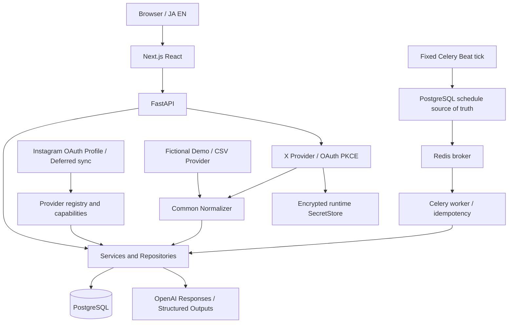

# Architecture — Version 2.0 Interim

[README](../../README.md)

## Data / job flow

Fetch → normalize → business transaction commit → sync state/checkpoint. PostgreSQL stores durable Job state and schedules; Beat runs a fixed tick rather than one dynamic cron entry per schedule. Delivery is at-least-once with idempotency, active-job exclusion and checkpoint rules, not exactly-once. Failed fetch pages do not commit partial business data or advance the checkpoint.

## Database

18 business/system tables + alembic_version = 19 public tables. V1's 13 tables are extended by provider_connections, provider_sync_states, job_runs, job_steps and job_schedules. Five migrations; head 0005_v2_provider_core. Existing migrations remain unchanged. [Final hashes](../release/v2_interim_release_candidate.json).

| Domain | Tables |
| --- | --- |
| Project / accounts | projects, project_platforms, sns_accounts, account_metrics |
| Posts / matching | sns_posts, post_metrics, watch_topics, watch_terms, post_topics, post_terms |
| Analytics / imports / AI | trend_daily, import_histories, ai_insights |
| V2 provider / jobs | provider_connections, provider_sync_states, job_runs, job_steps, job_schedules |
| Migration metadata | alembic_version |

## Providers / mode

CSV Provider is available in DEMO. X Complete / previously real-verified: account profile, OWN posts and OWN metrics; manual and scheduled sync. Instagram Deferred: OAuth / Profile foundation only, no posts/metrics/media/insights or pagination/initial/incremental sync. Capability checks apply to both stored capability and active adapter. Project data_mode is immutable. LIVE cannot import CSV or silently use Demo data.

## Secret boundary

Backend-only encrypted runtime storage holds OAuth pending state and provider tokens. Secret values do not go to business DB, frontend, job payloads or logs. OAuth has state TTL and replay protection; logs redact credentials. Files use 0600 and directories 0700 in Linux containers. Key loss prevents decryption; this is not multi-user authorization or security certification.

## AI boundary

One read-only aggregate snapshot → close database connection → external Responses API → validate structured content and Evidence IDs → append new AI snapshot. Content and evidence remain tied to the generation. History/Compare are DB reads with no external calls. Demo uses a fixed Fake fixture; saved viewing needs no API key. UI language does not translate saved content.

## Verification / limits

Instagram posts, metrics, media, insights, pagination and initial/incremental sync remain Deferred. Multi-user authentication, cloud production deployment, SLA and 24/7 operational proof are outside this release. Phase14 makes no real X, Instagram or OpenAI calls; X was previously real-verified. Demo AI is a fixed Fake fixture, not a real model quality evaluation. Stored posts and AI content are not translated. OWN import retains a per-post SELECT for preserved matching. Local benchmark timings are not a production SLA. Full screen-reader audio testing is unperformed.
